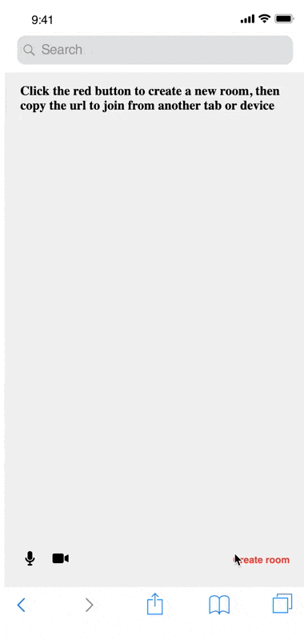

# Daily mobile demo

This demo mocks up a possible Daily call experience within a mobile browser.

## Prerequisites

- [Sign up for a Daily account](https://dashboard.daily.co/signup) if you'd like to test out your own meeting room URL in the demo.

## How the demo works

The demo calls the [Daily API](https://docs.daily.co/reference) to create and join a call. It passes custom styling properties that optimize the call layout for a mobile browser.

## Running locally

1. `cd daily-demos`
2. `cd static-demos`
3. `npm run start` or `npm run dev`
4. Then open your browser and go to `localhost:<port>/static-demos/mobile-demo/mobile-touches.html`

## Contributing and feedback

Let us know how experimenting with this demo goes! Feel free to [open an Issue](https://github.com/daily-co/daily-demos/issues), or reach us any time at `help@daily.co`.

## What's next

Consider building an [in-app mobile video call experience](https://docs.daily.co/docs/make-a-mobile-first-application-with-react-native-daily-js) using our React Native library.
